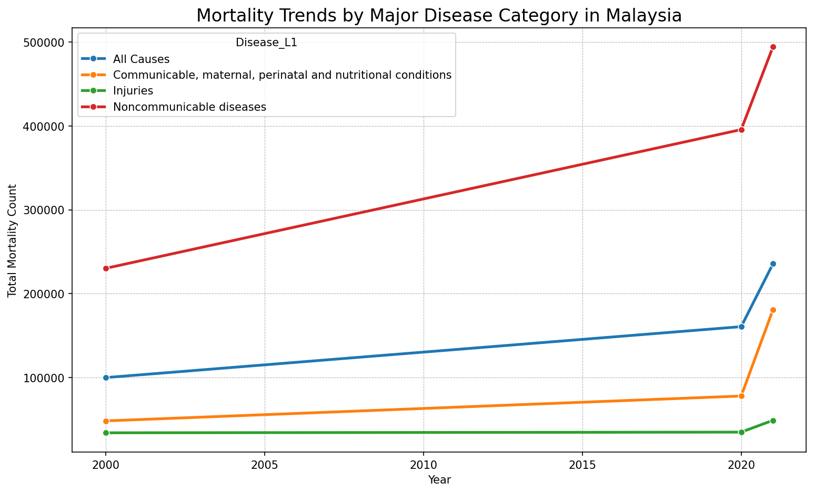
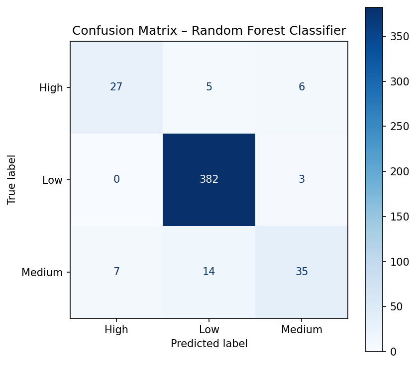
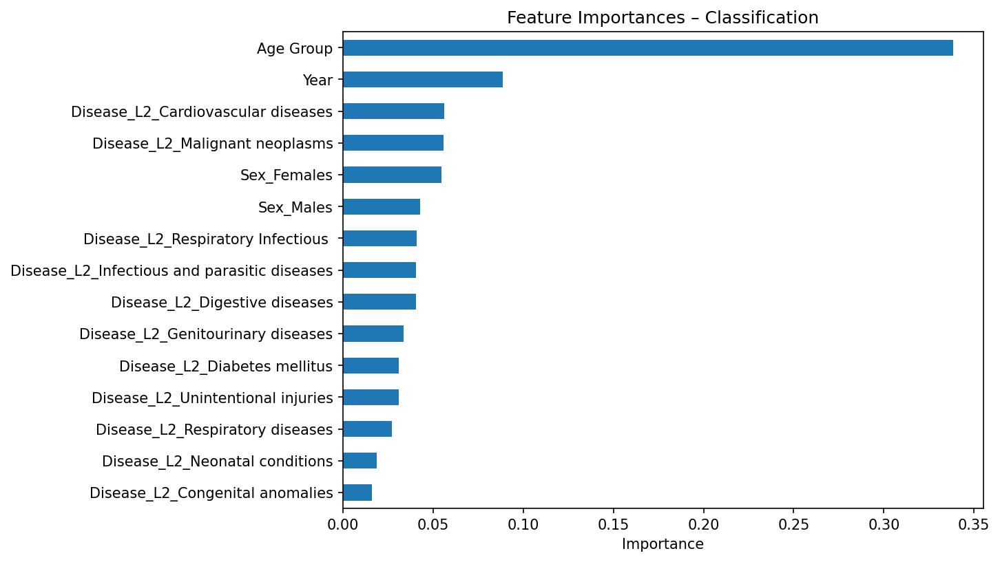
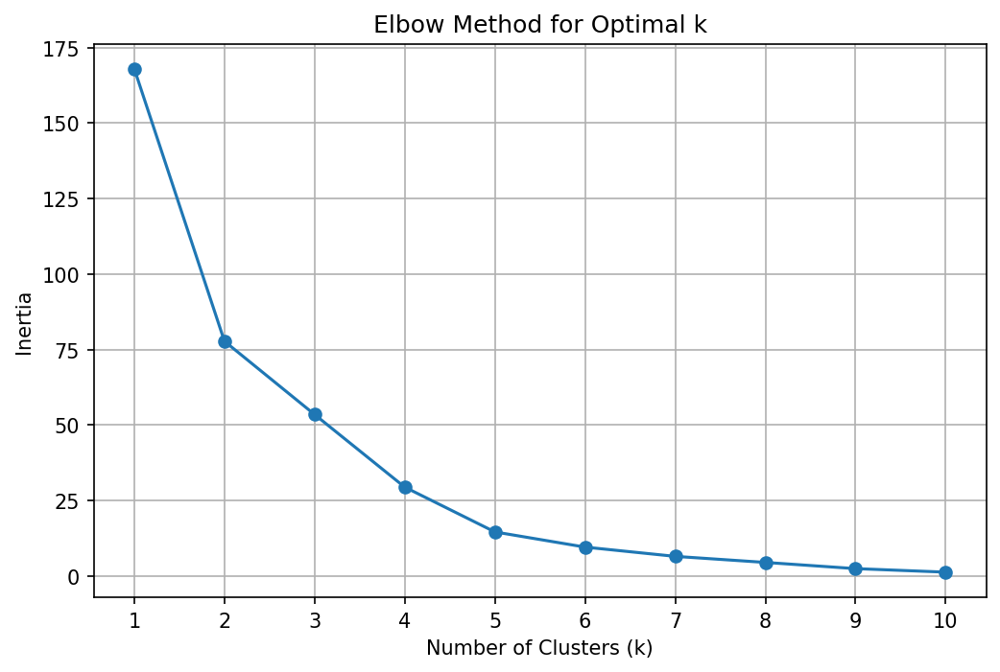
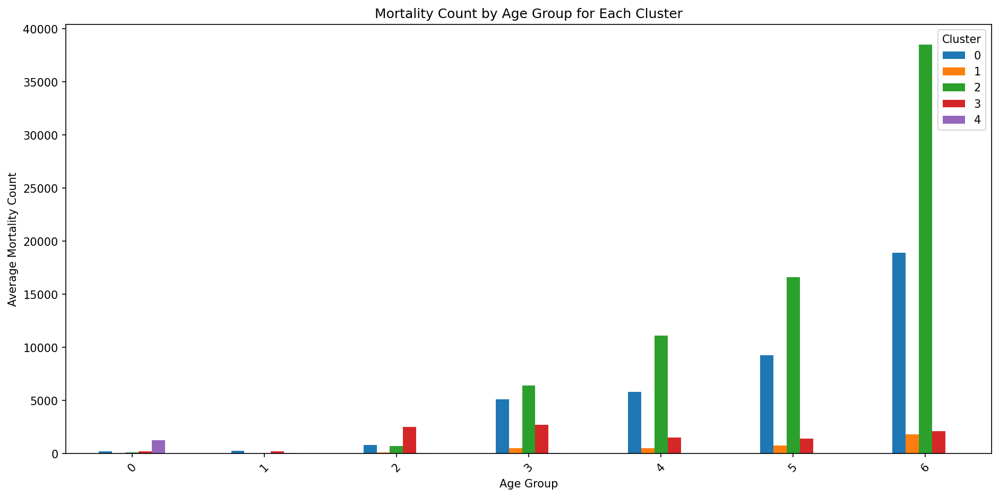
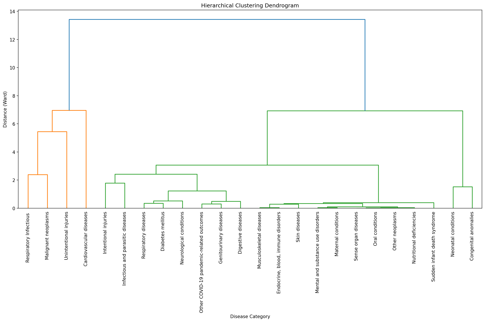

# WHO Global Burden of Disease — Malaysia Mortality Analysis

A end-to-end data-science project analysing mortality trends in Malaysia using the WHO Global Burden of Disease dataset (2000, 2020, 2021). The project covers the full analytics pipeline: **data preprocessing**, **classification**, **regression**, **clustering**, and **statistical hypothesis testing**.

> **Goal:** Predict mortality risk levels, forecast absolute mortality counts, discover disease-age profiles, and statistically quantify the impact of the COVID-19 pandemic on Malaysia's mortality landscape.

---

## Tech Stack


---

## Key Findings

| Analysis | Result |
|----------|--------|
| **Classification (Random Forest)** | **92.6% accuracy** predicting mortality risk (Low / Medium / High). |
| **Regression (Random Forest)** | **R² = 0.88** forecasting absolute mortality counts; MAE ≈ 181 deaths. |
| **Clustering (K-Means, k=5)** | Diseases segment into 5 epidemiological profiles, e.g. *Dominant Geriatric* (Cardiovascular), *Infant/Neonatal* (Congenital anomalies), *Mid-Life Risk* (Unintentional injuries). |
| **Statistical Testing** | Chi-squared confirms a **statistically significant association** between year and disease mortality distribution (p < 0.05), validating the pandemic's measurable impact. |

---

## Quick Start

This project uses [**uv**](https://docs.astral.sh/uv/) for dependency and environment management.

```bash
# 1. Clone the repository
git clone https://github.com/twilight39/who-mortality-risk-prediction.git
cd who-mortality-risk-prediction

# 2. Install dependencies (creates .venv automatically)
uv sync

# 3. Run the test suite
uv run pytest

# 4. Launch JupyterLab to explore notebooks
uv run jupyter lab
```

> **No `uv`?** You can still use pip: `pip install -r requirements.txt`

---

## Project Structure

```
.
├── data/
│   ├── raw/                    # WHO source CSVs (21 files, 2000/2020/2021 × 7 age groups)
│   └── processed/              # Generated EDA and model-ready datasets
├── notebooks/
│   ├── 1-DataPreprocessing.ipynb          # Parse WHO CSVs → EDA + model-ready DataFrames
│   ├── 2-ClassificationModelling.ipynb    # Predict mortality risk (Decision Tree & Random Forest)
│   ├── 3-RegressionModelling.ipynb        # Forecast mortality counts (Random Forest Regressor)
│   ├── 4-ClusteringAnalysis.ipynb         # K-Means & hierarchical clustering of disease profiles
│   └── 5-StatisticalAnalysis.ipynb        # Temporal trends, correlation, chi-squared, Cramér's V
├── src/
│   └── malaysia_mortality/    # Production-ready Python package (independent of notebooks)
│       ├── config.py
│       ├── data.py
│       ├── preprocessing.py
│       ├── features.py
│       ├── models.py
│       ├── evaluation.py
│       ├── stats.py
│       └── viz.py
├── tests/                      # pytest suite (27 tests)
├── reports/
│   └── figures/               # Static visualisations for this README
├── scripts/
│   └── generate_figures.py    # Reproducible figure generation pipeline
├── pyproject.toml             # Project metadata, dependencies, ruff & basedpyright config
├── uv.lock                    # Reproducible dependency lockfile
└── justfile                   # Task recipes: test, lint, notebook, figures
```

### Design Philosophy

- **Notebooks** are standalone narrative documents. They tell the analytical story and can be viewed directly on GitHub — GitHub renders `.ipynb` files natively, including cell outputs and plots.
- **`src/malaysia_mortality/`** is a fully independent, importable Python package demonstrating production-grade code: type hints, docstrings, reusable APIs, and unit tests.
- The two are **deliberately decoupled** — the package never depends on notebook code, and notebooks do not import from the package.

---

## Visualisations

### Temporal Mortality Trends

Mortality from non-communicable diseases (NCDs) rises steadily from 2000→2020, while 2021 shows a dramatic spike in communicable disease deaths driven by COVID-19.



### Classification — Confusion Matrix

The Random Forest Classifier achieves **92.6% accuracy**. The matrix reveals near-perfect identification of "Low" risk cases, with most confusion occurring between "Medium" and "High" risk.



### Feature Importances — Classification

Age group and year dominate model decisions, followed by specific disease categories such as Cardiovascular diseases.



### Clustering — Elbow Method

The elbow curve suggests k=5 as a good balance of granularity and compactness.



### Clustering — Disease Profiles by Age Group

Each cluster represents a distinct epidemiological pattern. Because the bar chart shows only centroids by age group, the disease membership of each cluster is listed below:

| Cluster | Diseases | Profile |
|---------|----------|---------|
| **0** | Malignant neoplasms, Respiratory Infectious | Age-accelerated chronic diseases — low mortality in youth, rising sharply after 50 |
| **1** | Diabetes mellitus, Digestive diseases, Endocrine/blood/immune disorders, etc. | Broad-spectrum low-prevalence diseases — persistent mortality across all age groups |
| **2** | Cardiovascular diseases | Dominant geriatric disease — exponential increase with age, leading cause of death in 60+ |
| **3** | Unintentional injuries | Mid-life & youth-risk diseases — mortality peaks in 15-49, then declines |
| **4** | Congenital anomalies, Neonatal conditions | Infant/neonatal diseases — mortality almost exclusively in 0-4 age group |



### Hierarchical Clustering Dendrogram

The highest-level split isolates infant mortality patterns (Neonatal conditions, Congenital anomalies) from all other diseases, confirming their fundamental distinctness.



---

## Modelling Approach

### Feature Engineering
- **Age Group** — ordinally encoded (`0-4`→0, `5-14`→1, …, `70+`→6) to preserve natural ordering.
- **Sex** — one-hot encoded into `Sex_Females`, `Sex_Males`, `Sex_Persons`.
- **Disease** — `Disease_L2` is one-hot encoded for both classification and regression.
- **Target: Risk Levels** (classification) — bucketed from raw mortality counts: `<500` → Low, `500–1999` → Medium, `≥2000` → High.

### Models & Hyperparameters
All scikit-learn models use `random_state=42` for full reproducibility.

| Task | Model | Key Hyperparameters | Test Metric |
|------|-------|---------------------|-------------|
| Classification | Decision Tree | default | 90.1% accuracy |
| Classification | Random Forest | `n_estimators=100`, `n_jobs=-1` | **92.6% accuracy** |
| Regression | Random Forest Regressor | `n_estimators=100`, `n_jobs=-1` | **R² = 0.88**, MAE ≈ 181 |
| Clustering | K-Means | `n_clusters=5`, `n_init=10` | Elbow method + silhouette |
| Clustering | Hierarchical | `method='ward'` | Dendrogram validation |

- **Train/test split:** 70/30 stratified split (`test_size=0.3`).
- **Scaling:** `StandardScaler` applied before clustering so high-mortality age groups (e.g. 70+) do not dominate distance calculations.

## Code Quality & Tooling

The project enforces consistent code quality across both the package and notebooks:

| Tool | Purpose | Command |
|------|---------|---------|
| **ruff** | Linting & import sorting | `uv run ruff check .` |
| **ruff** | Auto-formatting | `uv run ruff format .` |
| **basedpyright** | Static type analysis | `uv run basedpyright` |
| **pytest** | Unit tests (27 tests) | `uv run pytest -v` |
| **jupytext** | Sync `.py` ↔ `.ipynb` | `just notebook` |

Notebooks are excluded from strict linting (they are narrative documents), but `src/` and `tests/` are held to full standards.

## Running the Full Pipeline

```bash
# Run all notebooks end-to-end (populates cell outputs)
uv run jupyter execute notebooks/*.ipynb

# Regenerate .ipynb files from Jupytext .py sources
just notebook

# Regenerate README figures
uv run python scripts/generate_figures.py

# Lint, format, and type-check
just lint
just fmt
uv run basedpyright
```

---

## Dataset

Source: [WHO Global Burden of Disease](http://www.who.int/healthinfo/global_burden_disease/en/)

The raw data consists of 21 CSV files (3 years × 7 age groups) containing mortality counts per 1,000 population. The preprocessing script:
1. Skips 7 metadata header rows
2. Locates the Malaysia (`MYS`) column
3. Parses the 4-level disease hierarchy (L1→L4)
4. Converts per-1,000 counts to absolute counts (×1000)
5. Produces two artefacts:
   - `malaysia_mortality_data_eda.csv` — full dataset for exploration
   - `malaysia_mortality_data_model.csv` — L2-focused dataset for modelling

---

## Testing

```bash
uv run pytest -v
```

The test suite covers:
- Configuration constants
- WHO filename parsing & disease-hierarchy extraction
- Feature engineering (risk levels, encoding)
- Model factories (classifier, regressor, K-Means, hierarchical)
- Evaluation metrics & feature-importance reporting
- Statistical tests (Pearson correlation, chi-squared, Cramér's V)

---

## License

MIT
